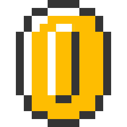

# react-handson-vol0

## 教材内容

ブロックを押すと、コインが飛び上がる。

stateで自分自身の状況を判断して、連続でクリックされてもバグらないように。

## ハンズオン

### 1. app.jsの作成

まずは`javascripts/app.js`を編集します。空のファイルが追加されてます。

これはReactがアプリを起動するために一番最初に読み込まれるコードです。

```js
var React = require("react");
var ReactDOM = require("react-dom");

// 後で作るApp.jsxをここで呼び込んでおく
var App = require("./components/App.jsx");

// ReactDOMのrenderメソッドでレンダリング
ReactDOM.render(
	<App/>,
	document.getElementById("react")
)
```

### 2. App.jsxの作成

次に`components/App.jsx`を作ります。

```js
var React = require("react");

var App = React.createClass({

	render: function(){
		return(
			<div>
				<h1>Hello React</h1>
			</div>
		)
	}
})

module.exports = App;
```

```module.exports = App;```の部分を忘れないように注意して下さい。

### 3. npm start

ターミナルに戻って、コンパイルを実行します。

```
$ npm start
```

最初の一回は少し時間がかかります。

ここまで作成したら、ブラウザでindex.htmlを開いてみましょう。

「Hello React」と表示されていればOKです。

編集 -> 自動ビルド -> ブラウザで確認の流れで開発を進めます。

### 4. Block、Coinの作成

``component/Block.jsx``、``component/Coin.jsx``を作成していきます。


```js
var React = require("react");

var Block = React.createClass({

	render: function(){
		return(
			<div>
				<p>This is Block</p>
			</div>
		)
	}
})

module.exports = Block;
```


```js
var React = require("react");

var Coin = React.createClass({

	render: function(){
		return(
			<div>
				<p>This is Coin</p>
			</div>
		)
	}
})

module.exports = Coin;
```


### 5. Block、Coinの読み込み

先ほど作成したApp.jsxを編集して、Block、Coinを読み込んでいきます。

```js
var React = require("react");
var Block = require("./Block.jsx");
var Coin = require("./Coin.jsx");

var App = React.createClass({

	render: function(){
		return(
			<div>
				<h1>Hello React</h1>
				<Coin />
				<Block />
			</div>
		)
	}
})

module.exports = App;
```

ここまで出来たら、ブラウザで確認して行きましょう。

### 6. Blockの実装

Blockを実装していきます。

```js
var React = require("react");

var Block = React.createClass({

	render: function(){
		return(
            <div className="img block" onClick={this._onClick}>
                
            </div>
        )
	},

	_onClick : function(){
		alert("block clicked!")
	}

})

module.exports = Block;
```

### 7. Coinの実装


```js
var React = require("react");

var Coin = React.createClass({

	render: function(){
		return(
			<div className={this.props.coinClass}>
                
            </div>
		)
	}
})

module.exports = Coin;
```

Coinのクラスは書き換えが可能なように``props``経由で指定します。

App.jsxを編集してCoinのクラスを変更します。

```js
var App = React.createClass({

	render: function(){
		return(
			...
			<Coin coinClass="img coin" />
			...
		)
	}
})
```


### 8. クリックイベントでCoinのクラスを書き換える

App.jsxを編集します。

```js
var App = React.createClass({

	getInitialState : function(){
		return {
			coinClass : "img coin"
		}
	},

	render: function(){
		return(
			...
			<Coin coinClass={this.state.coinClass} />
			<Block classChange={this._classChange} />
			...
		)
	},

	_classChange: function(){

		this.setState({ coinClass: "coin img animating" });

	}

})
```

Block.jsxを編集して、クリックイベントを処理する箇所を書き換えます

```js
var React = require("react");

var Block = React.createClass({

	render: function(){
		return(
            <div className="img block" onClick={this._onClick}>
                
            </div>
        )
	},

	_onClick : function(){
		this.props.classChange();
	}

})

module.exports = Block;
```

AppとBlockのイベントのつながりを``props``経由で行います。

ここでブラウザで確認しましょう。ブロックをクリックするとコインが飛び出ることを確認してください。


### 9. 二回目以降が出来るようにする

コインが何度も飛び出るように、App.jsxを書き換えます


```js
var App = React.createClass({

	_classChange: function(){

		var self = this;
		this.setState({ coinClass: "coin img animating" });

		setTimeout(function(){
			self.setState({ coinClass: "coin img" });
		}, 800);

	}

})
```

### 10. 10回クリックしたら押せないように書き換えましょう

ブロックを10回クリックしたらもう出ないように書き換えましょう

10回を設定していくのに、`components/Block.jsx`を書き換えていきます。

```js
var React = require("react");

var count = 0,
		MAX_COUNT = 10;

var Block = React.createClass({

	render: function(){
		return(
            <div className="img block" onClick={this._onClick}>
                
            </div>
        )
	},

	_onClick : function(){

		if(count < MAX_COUNT){

			this.props.classChange();
			count += 1;
		
		}else{
			this.refs.block_image.src = "images/block.png";
			alert("コインはもう出ません");
		}
	}

})

module.exports = Block;
```

ここでブラウザ確認しましょう。10回押すともう押せないとアラートが出てブロックの画像が書きかわるはずです。

### 11. アニメーション中はクリックできないように書き換えます

```js
var React = require("react");

var count = 0,MAX_COUNT = 10;

var Block = React.createClass({

	getInitialState: function(){
		return{
      isAnimating: false
    }
	},

	render: function(){
		return(
            <div className="img block" onClick={this._onClick}>
                
            </div>
        )
	},

	_onClick : function(){

		if(this.state.isAnimating) return;

		if(count < MAX_COUNT){

			var self = this;

			this.props.classChange();
			this.setState({ isAnimating: true });
			setTimeout(function(){
				self.setState({ isAnimating: false });
      },800);
			count += 1;
		
		}else{
			this.refs.block_image.src = "images/block.png";
			alert("コインはもう出ません");
		}
	}

})

module.exports = Block;
```

これで、アニメーション中にクリックできないようになっています。